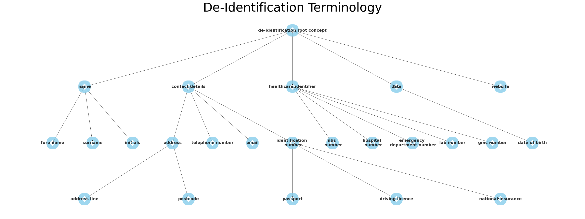

# Automated de-identification of free-text electronic patient records (EPR)

Medical records are full of confidential and highly sensitive patient information, which are required
to be removed if they are to be used for secondary purposes beyond direct patient care.

This project aims to remove the following personal data from within patient records whilst
retaining the top level meaning of the redacted information.

__For example:__
 "Anthony suffers from Epilepsy. He was born on 01/01/1900"
 "\[Patient name\] suffers from Epilepsy. He was born on \[Date of birth\]"

This repository is currently incomplete and is not fit for use.

## Personal information redacted

A brief overview of the categories of personal information redacted.

|Value|Description|
|---|---|
|Names| First and last names and any abbreviations|
|Dates| all dates|
|Contact details| Addresses and unique identifiers|
|Healthcare identifiers| Numbers which may identify an individual|
|||

## Concept Terminology Structure

The structure of the created terminology:

### Meta annotations 
Concepts will be combined with "Meta-annotations". i.e. an annotation of an annotation. 
This will hold the contextual information of the concept.

|Meta-annotation|Values|Description|
|---|---|---|
|Subject|"Patient" "Relative"  "Healthcare Provider"  "Other/ N/A"| Who is the subject of the identified concept?
 

## MedCAT
This project revolves around the application of the CogStack/MedCAT packages.  
For further information on the MedCAT tool is available [here](https://github.com/CogStack/MedCAT).

## Building the MedCAT Model foundations

There are two essential components of the MedCAT model required for this project.

1) Vocab

2) Concept Database (CDB)

## Training the model

This base model is trained using the [MedCATtrainer](https://github.com/CogStack/MedCATtrainer) platform to annotate any 
identifiable information from Medical records.

